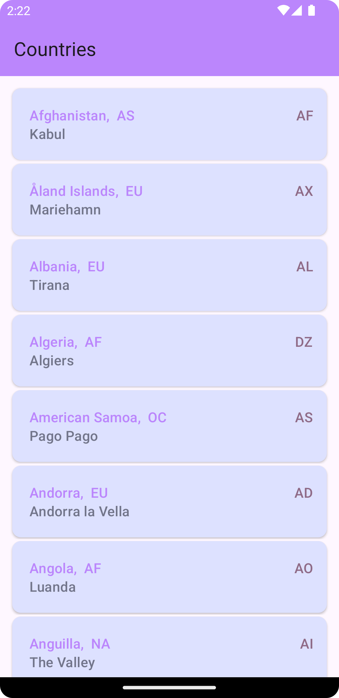

# FetchCountryList App
Displays all the countries in a Fragment RecyclerView 

## Tech Stack
- Kotlin programming language.
- MVVM clean code architecture.
- Manual Dependency Injection.
- ListAdapter using DiffUtil for better performance.
- Retrofit for API calls
- Screen rotation handling

  
 
